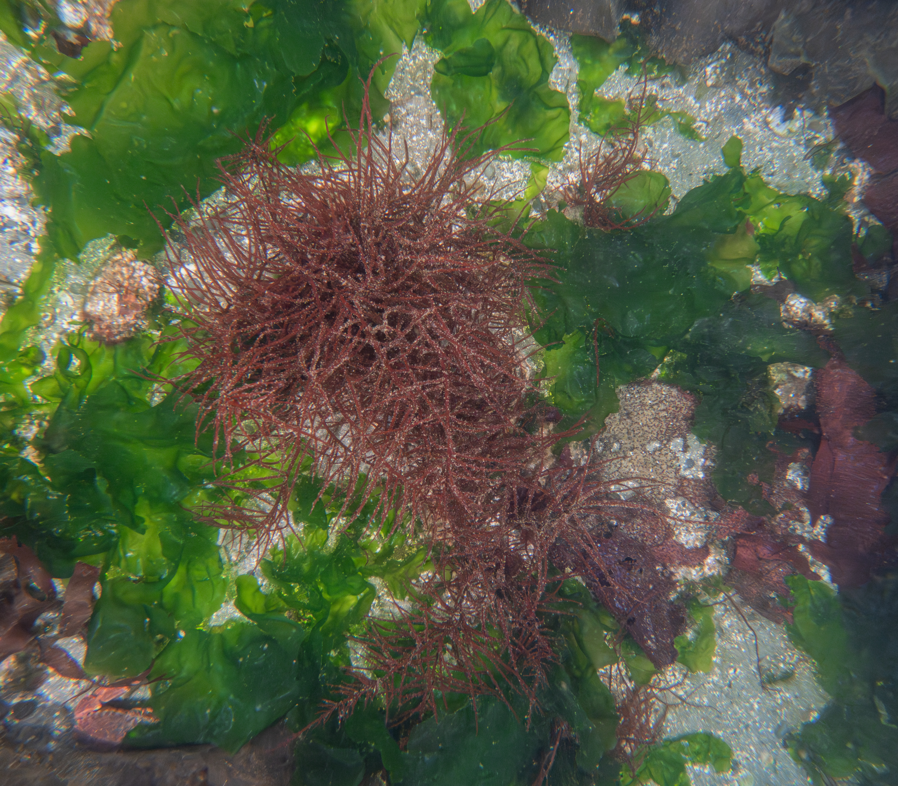
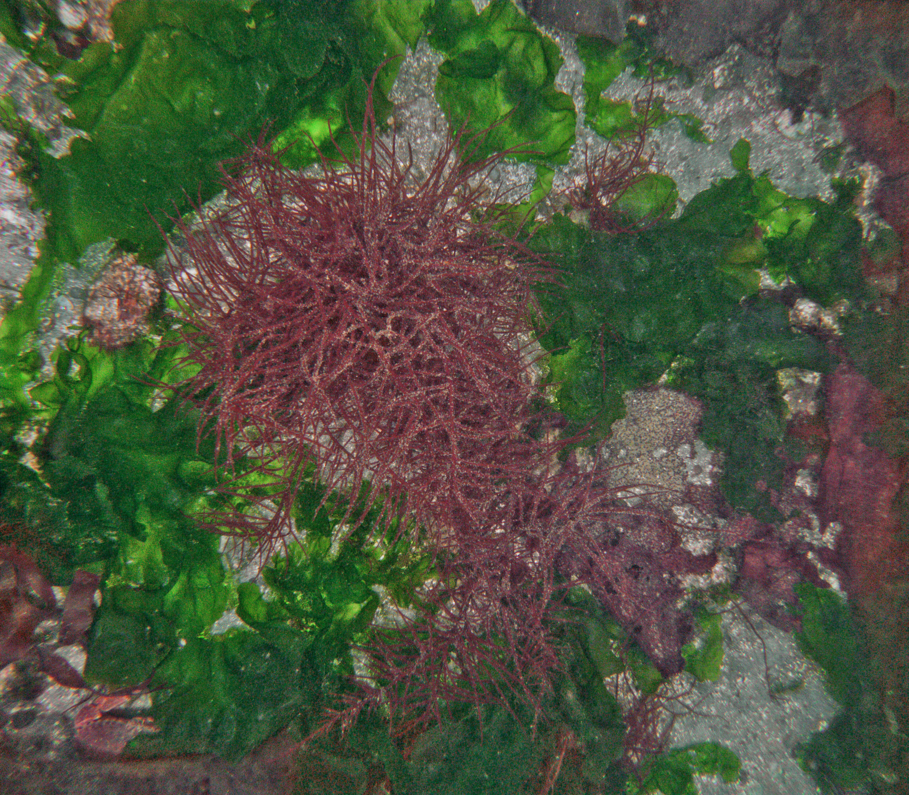
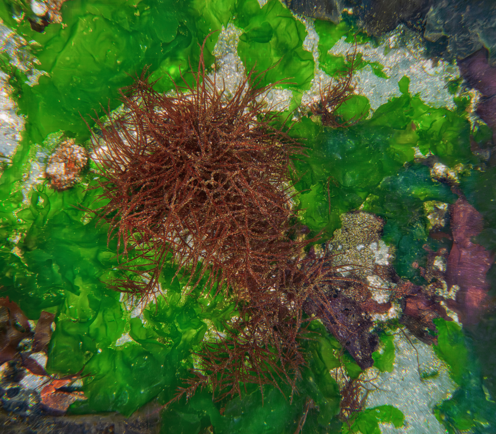
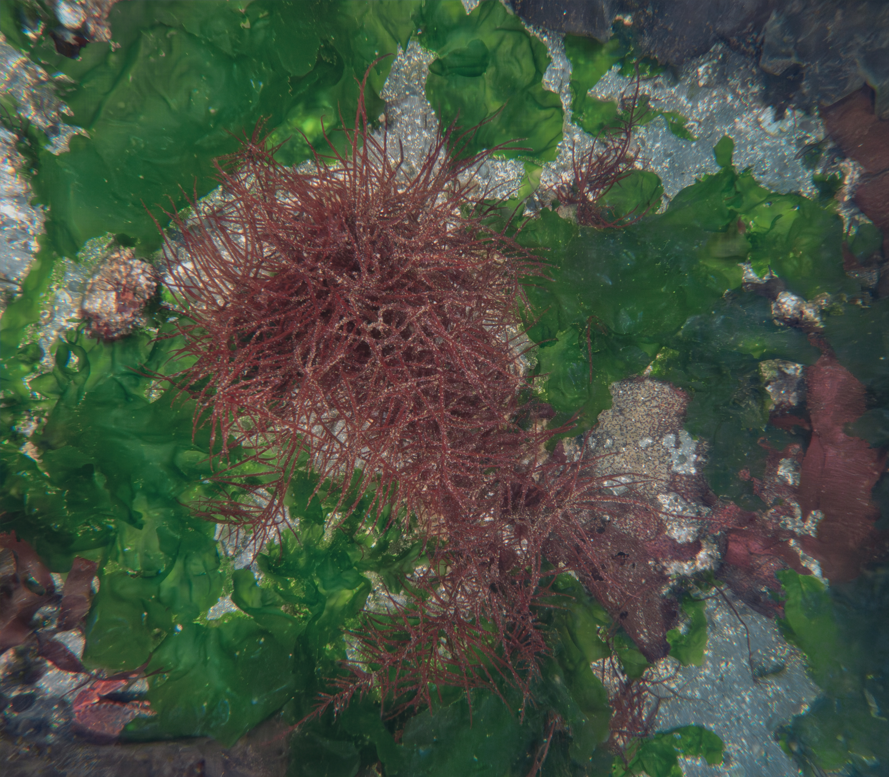
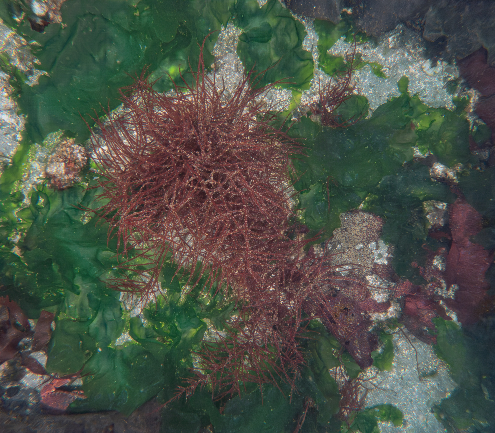

# CCR_image_processing

## Overview
This repo is intended to aggregate information regarding the automation of our ROV survey imagery processing. 
Our overarching hope is to train a model to process our ROV survey imagery for us, such that the output files are then ready for subsequent analyses to extract data. 
Specifically, we currently use Adobe Lightroom Classic (ALC) to batch process anywhere from 100 to 200 images at a time, from a single ROV survey.
We apply the de-noise feature, edit white-balance, brightness, crop, etc., enabling us to extract as much detail as possible from our images.
This thoroughly prepares them for our ML approach ([CoralNet-Toolbox](https://github.com/Jordan-Pierce/CoralNet-Toolbox)) to extract percent-cover and abundance data from them. 

At present, this photo processing step is by far the most rate-limiting--it's the bottleneck preventing us from more rapidly translating ROV survey imagery --> processed and analyzed results.
See [here](https://github.com/Seattle-Aquarium/CCR_development/blob/main/1-pagers/AI-ML_image_processing.md) for a 1-pager description of the problem on our CCR_development repo.

The latest developments on this issue come from the [Underwater Image Enhancer](https://github.com/keenanjohnson/underwater-auto-image-encoder) tool.
The UIE allows us to leverage our set of over 6,000 hand-edited images to train in-house machine learning models that will automate image processing.
Our training dataset and model iterations are accessible on Hugging Face [here](https://huggingface.co/Seattle-Aquarium).
See below examples of our progress thus far; and track model output developments [here](https://www.dropbox.com/scl/fo/4c5l2lgexeg2obd00etlq/ACEY4P0p0Mv7A_xmAvdH0DA?rlkey=krt2s3jnjkwecua89bn33not5&dl=0).

We have linked to image sets here to facilitate testing, model training, and workflow development. 

* [linked here](https://github.com/Seattle-Aquarium/CCR_image_processing/tree/main/testing_image_sets) is our standard 20-image testing set - including the original .GPR files, hand-edited (in ALC) .JPG files, and de-noised (in ALC) .TIF files. This smaller dataset is to enable prototyping.
* [linked here](https://www.dropbox.com/scl/fo/0jm7jocha7uj5ce9u1vvx/AILmrQqqiT18ghbCHFxDcng?rlkey=jyiiskar6n33miprjcl5qxpaz&e=1&st=v51ehwym&dl=0), as an alternative to Hugging Face, are 5000 image pairs: the raw .GPR and the hand-edited .JPG files. This larger dataset is to enable full-scale modeling training/deployment.

  
  <em>Hand-edited image</em>

  
  
  <em>Early model iterations</em>

  
  
  <em>Current model iterations</em>

