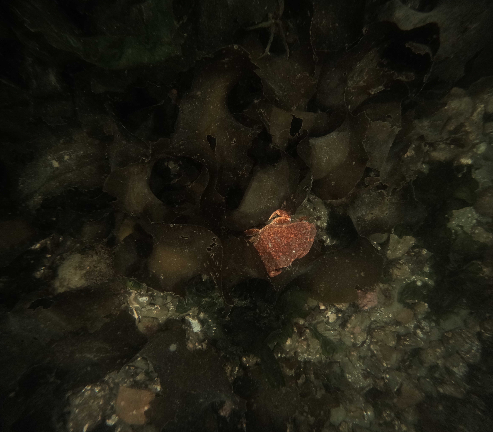
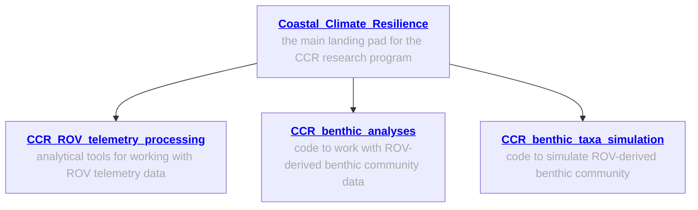
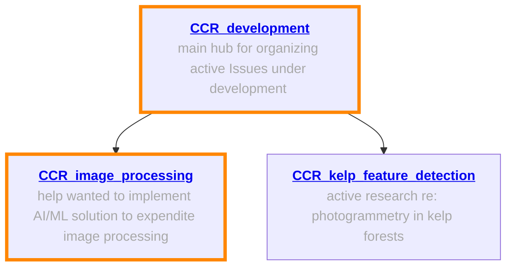

# CCR_image_processing

## Overview
This repo is intended to aggregate information regarding the automation of our ROV survey imagery processing. 
Our overarching hope is to train some sort of ML framework to process our ROV survey imagery for us, such that the output files are then ready for subsequent analyses to extract data. 
Specifically, we currently use Adobe Lightroom to batch process ~150 images at a time, from a single ROV survey.
We use a de-noise feature, edit white-balance, contrast, sharpness, tone, etc., enabling an image sufficiently details for our ML approach ([CoralNet-Toolbox](https://github.com/Jordan-Pierce/CoralNet-Toolbox)) to extract percent-cover and abundance data from them. 

At present, this photo processing step is by far the most rate-limiting--it's the bottleneck preventing us from more rapidly translating ROV survey imagery --> processed and analyzed results. 

With ~ 5000 fully processed images (with both the "raw" original image and the "processed" output image in hand), we hope to, e.g., train a Generative Adversarial Network (GAN) to process our imagery for us. 
We have ~ 7000 images awaiting processing, with more coming this upcoming field season (August, September 2025). 

See [here](https://github.com/Seattle-Aquarium/CCR_development/blob/main/1-pagers/AI-ML_image_processing.md) for a 1-pager description of the problem on our CCR_development repo. 

To provide example imagery, a folder containing 10 raw (pre-processing, .GPR), preview (pre-processing, .JPEG), and polished (processed, JPEG) can be found [here](https://github.com/zhrandell/CCR_image_processing/tree/main/example_raw_and_processed_photos). 

  
  
 

## General information; workflows ready to implement
The following repos contain general information about our work, and specialized repos for ROV telemetry analyses, processing and analyses of ROV-derived benthic abundance and distribution data, and simulating benthic data.  

## Help wanted! 
The following repos involve active areas of open-source software development, AI/ML implementation, and computer vision challenges; areas where we could use assistance are 🔶 highlighted in orange 🔶

