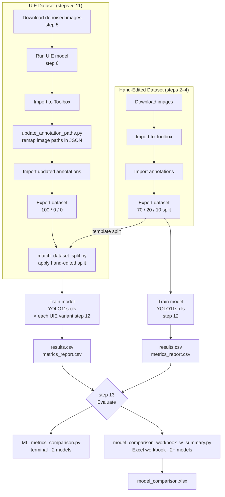

# SOP for Comparing UIE Output to Hand-Edited Images for Classification Training

This SOP describes how to prepare matched datasets (hand-edited vs. UIE), train Ultralytics YOLO classification models in the [CoralNet Toolbox](https://github.com/Jordan-Pierce/CoralNet-Toolbox) (v0.0.97), and compare model performance to evaluate how image enhancement affects classifier accuracy.

---

## Pipeline Overview



---

## 1. Toolbox Installation and Setup

Instructions for installing and running Toolbox are available here:  
<https://www.dropbox.com/scl/fi/ut3k3invqvyhyyj168332/Toolbox_installation.docx?rlkey=qob1tuoqmnaljc87blidohpx3&dl=0>

---

## 2. Download Hand-Edited Images

- Download hand-edited images:  
  <https://www.dropbox.com/scl/fo/umlj1pxafrh1yvq95yqdd/AO5Wda5BCHeFTtf0oY66Zfg?rlkey=doxnwseic0ryfur9d1zwti5zm&dl=0>
- Import images into Toolbox:  
  **File → Import → Rasters → Images**

---

## 3. Import Annotations for Hand-Edited Images

- Import JSON annotation file:  
  **File → Import → Annotations → JSON**
- Annotation file:  
  <https://www.dropbox.com/scl/fi/szmbbw9goc33m3ltzutfl/hand_edited_annotations.json?rlkey=35yv4t0615yo49jg932ha619z&dl=0>
---

## 4. Export the Hand-Edited Dataset

Export annotations into a classification dataset:

- **File → Export → Dataset → Classify**
- Train/val/test split: **0.7 / 0.2 / 0.1**

This dataset serves as the *template* for splitting the UIE dataset.

---

## 5. Prepare UIE Images

- Download denoised images (before UIE processing):  
  <https://www.dropbox.com/scl/fo/8jq105ipliepvyy7u0jcs/AKsNmLaV7oNmFgbULJ-i-W4?rlkey=rasoq2000uat55jpl8pbjmu4r&st=8serhg2v&dl=0>

Ensure the UIE images correspond **exactly** to the hand-edited images:

- Same filenames  
- Same image dimensions  
- Same number of images  

---

## 6. Create UIE-Enhanced Images

Use the [underwater-auto-image-encoder](https://github.com/Seattle-Aquarium/underwater-auto-image-encoder) to run the UIE model on the denoised images downloaded in Step 5.

**GUI (no programming required):**
1. Download the desktop application and trained model (.pth file) from the repo
2. Open the app and load the trained model checkpoint
3. Select the folder of denoised images (from Step 5) as input
4. Run the model — enhanced JPEGs are written to the output folder

**Command line:**
```bash
python inference/inference.py /path/to/denoised/images \
  --checkpoint checkpoints/best_model.pth \
  --output /path/to/uie/output
```

Before proceeding, confirm the output images satisfy the requirements in Step 5 (same filenames, dimensions, and count as the hand-edited images).

---

## 7. Import UIE Images into Toolbox

- **File → Import → Rasters → Images**

---

## 8. Edit Hand-Edited JSON Annotation File to Point to UIE Images

Because UIE images are stored in a different folder, the annotation JSON from the hand-edited set must be updated so that every `"image_path"` points to the UIE directory.

### Run the JSON path update script

Use `update_annotation_paths.py` to automatically update all `"image_path"` entries.

The script will:

- Ask for the path to the *original* annotation JSON  
- Ask for the path to the **UIE image folder**  
- Ask where the updated JSON should be saved (and what to name it)  
- Replace only the directory portion of each `"image_path"` (filenames remain unchanged)  
- Output a new JSON annotation file ready for import into Toolbox

---

## 9. Import the UIE Annotations

- Import the updated JSON file produced in Step 8:
  - **File → Import → Annotations → JSON**

---

## 10. Export the UIE Dataset

Export the UIE annotations to a dataset:

- **File → Export → Dataset → Classify**
- Train/val/test split: **1.0 / 0.0 / 0.0**

This creates a dataset that will later be re-split to match the hand-edited dataset.

---

## 11. Match the UIE Dataset to the Hand-Edited Split

Use `match_dataset_split.py` to apply the same train/val/test split as the hand-edited dataset.

The script:

- Reads all files in **TEMPLATE/train/labels**, **val/labels**, **test/labels**
- Finds matching filenames in the UIE dataset  
- Moves UIE label files into **TARGET/train**, **TARGET/val**, and **TARGET/test**  
- Ensures *identical image patches* are used in both datasets

**Outcome:**  
Two datasets containing the *same* image patches, enabling a fair and controlled comparison of classification model performance.

---

## 12. Train Classification Models  
*(Train once for the hand-edited dataset and once for the UIE dataset)*

- Ultralytics → **Train Model → Classify**
- In the training window:
  - **Dataset:** Browse → select dataset root folder  
  - **Model:** `YOLO11s-cls`  
  - **Parameters:**  
    - Set save location for trained model  
    - Use default training hyperparameters
- Click **OK** to begin training  
Training progress appears in the terminal.

---

## 13. Evaluate Training Results

After training completes, examine the model output folder and review:

### `results.csv`

- **Best validation Top-1 accuracy**  
  → Primary measure of classifier performance

- **Best validation Top-5 accuracy**  
  → Higher Top-5 suggests richer or more informative images

- **Validation loss**  
  → Lower loss at similar accuracy indicates better calibration

### `metrics_report.csv` (found in the test subfolder)

- **Macro F1** *(primary metric)*  
  → Mean F1 across all classes with equal weight per class. Appropriate for imbalanced datasets because it does not inflate the score for majority classes. Zero-sample classes (e.g. `background`) are excluded from the average.

- **Macro Balanced Accuracy**  
  → Mean balanced accuracy across classes; corroborates Macro F1.

- **Per-class table (Precision / Recall / F1 / Total Samples, sorted worst-first)**  
  → Identifies which substrate (`SU_*`) or kelp (`KE_*`) categories are hardest to classify. Classes with fewer than 10 test samples are flagged — their metrics are unreliable.

> **Note:** Weighted F1 (weighted by class sample size) is *not* reported here because it is dominated by the most common categories and can mask poor performance on rare substrate or kelp species that matter ecologically.

---

---

## 14. Automated Comparison Scripts

Two scripts are available for comparing models. Both apply the same metric conventions: macro F1 as the primary metric, weighted F1 omitted, zero-sample classes excluded from aggregates, and classes with fewer than 10 test samples flagged as low-confidence.

### `ML_metrics_comparison.py` — quick terminal comparison (2 models)

Use for a fast side-by-side check of two training runs (e.g., hand-edited vs. one UIE model).

**When to run:** during exploratory analysis or when comparing a single pair.

**Inputs prompted:**
- Friendly name, `results.csv`, and `metrics_report.csv` for each of the two models

**Output (terminal):**
- Aggregate summary table: Top-1, Top-5, val loss, Macro F1, Macro Balanced Accuracy; overall winner declared
- Per-class comparison table: Precision / Recall / F1 for both models, Δ%, and winner per class — sorted by absolute F1 difference (largest gaps first)

---

### `model_comparison_workbook_w_summary.py` — full Excel workbook (2+ models)

Use when comparing three or more models, or when a shareable report is needed.

**When to run:** for final analysis across all UIE variants vs. the hand-edited baseline.

**Inputs prompted:**
1. Model name, `results.csv`, `metrics_report.csv` — repeat for each model (press Enter when done)
2. Baseline model name (must match one entered above)
3. Output folder for the Excel file

**Output (`model_comparison.xlsx`):**

| Sheet | Contents |
|---|---|
| **Executive Summary** | Overall winner with reason; macro accuracy/F1 per model; overfitting verdict and training suggestion; per-category winner table sorted by F1 range; head-to-head win counts; categories needing attention |
| **training_summary** | Best epoch, Top-1/Top-5 accuracy, val loss, val–train gap |
| **macro_summary** | Macro Precision / Recall / F1 / Balanced Accuracy per model (zero-sample classes excluded) |
| **vs\_\<baseline\>\_\_\<model\>** | Per-class P/R/F1 for baseline and comparison model; Δ% columns; winner per class; low-sample flags |
| **\<a\>\_vs\_\<b\>\_vs\_\<baseline\>** | Three-model side-by-side with bottleneck analysis (which of Precision or Recall is limiting each UIE model) and direct UIE-vs-UIE Δ% |

All numeric columns are color-coded: green = high/improving, red = low/degrading.

---
